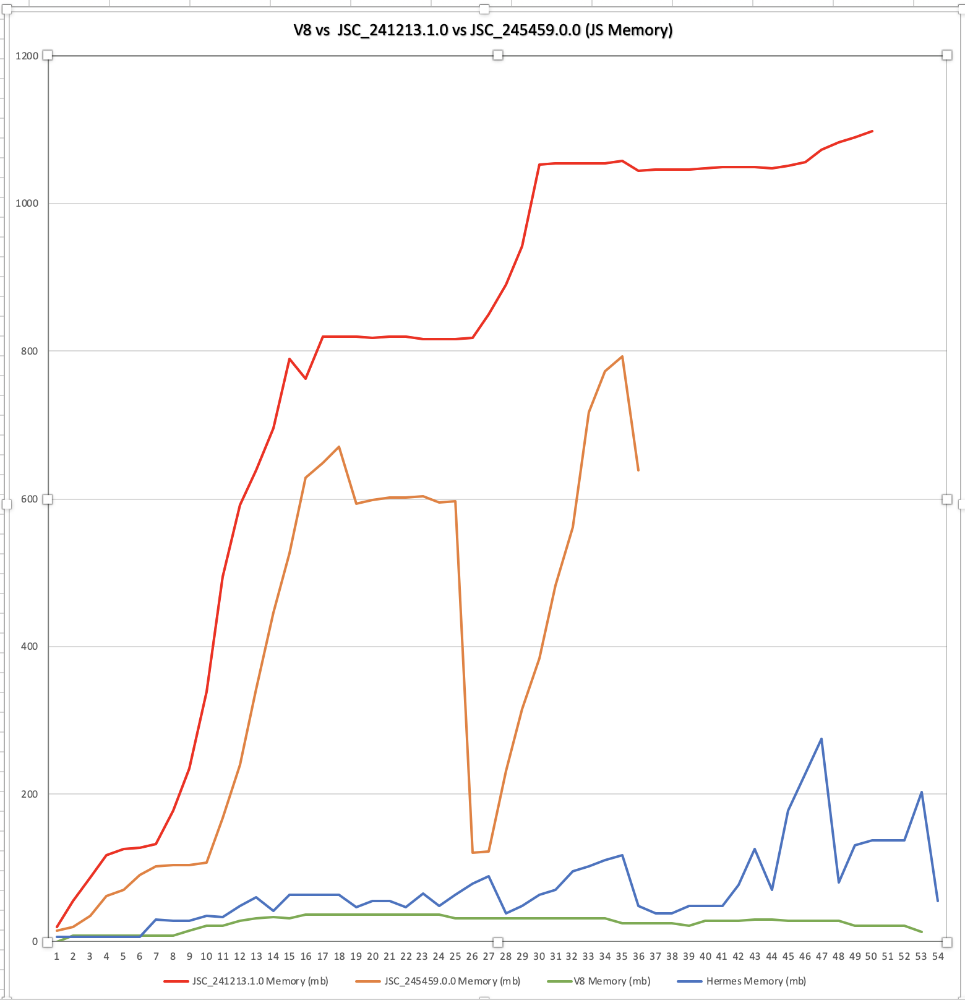

# react-native-memory-profile (JSC vs V8)

1. Checkout brach for which you want to do memory profiling 
2. npm i
3. run server in seperate terminal with npm run start-server
4. react-native run-android (for devlopment)
5. cd android && ./gradlew assembleRelease for release apk 

## To test apk without setup
Download APK from respective branch under ${PROJECT_ROOT}/releaseAPK

#Observations

